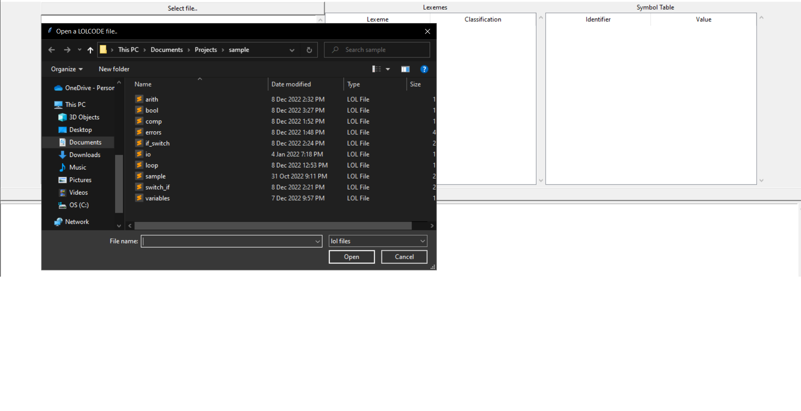
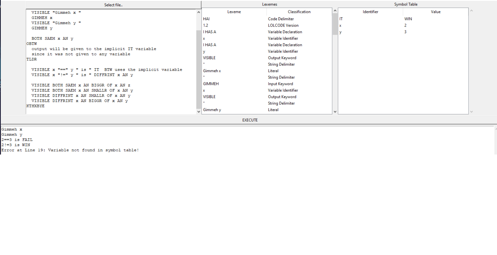
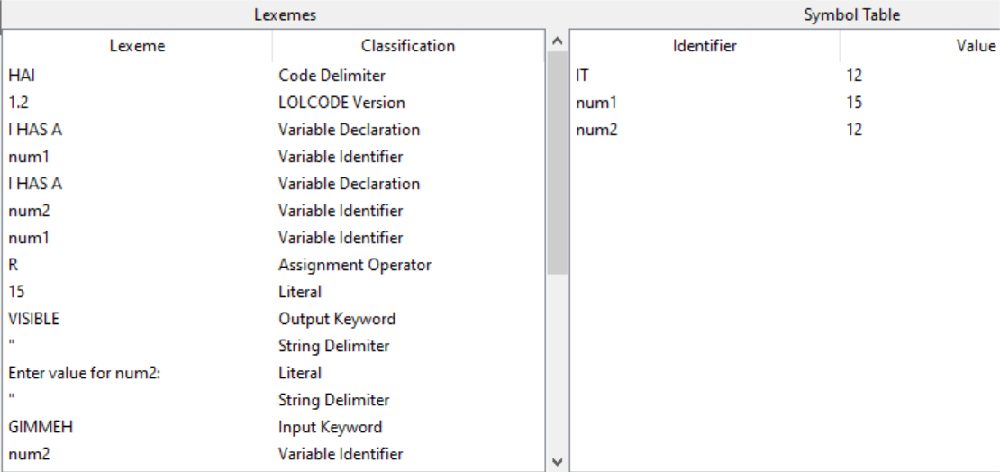
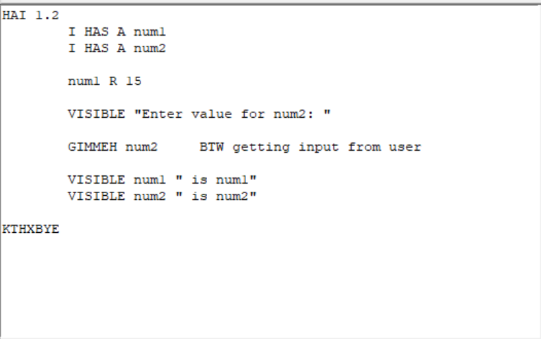

# LOLCODE Interpreter
### Bitancor, Marlon S.

### App Overview
This is a A programming language interpreter designed to replicate the LOLCODE programming language syntax and functions

### App features
1. File Opening
> Users can open .lol files and execute them seamlessly

2. Error Catching
> The interpreter can catch errors and which line the error occurred

3. Lexeme and Symbol Table
> The interpreter lists the lexemes with their classification and variables used and its values

4. Writing Code in LOLCODE
> Users can easily write code in the LOLCODE programming language with the provided text editor

